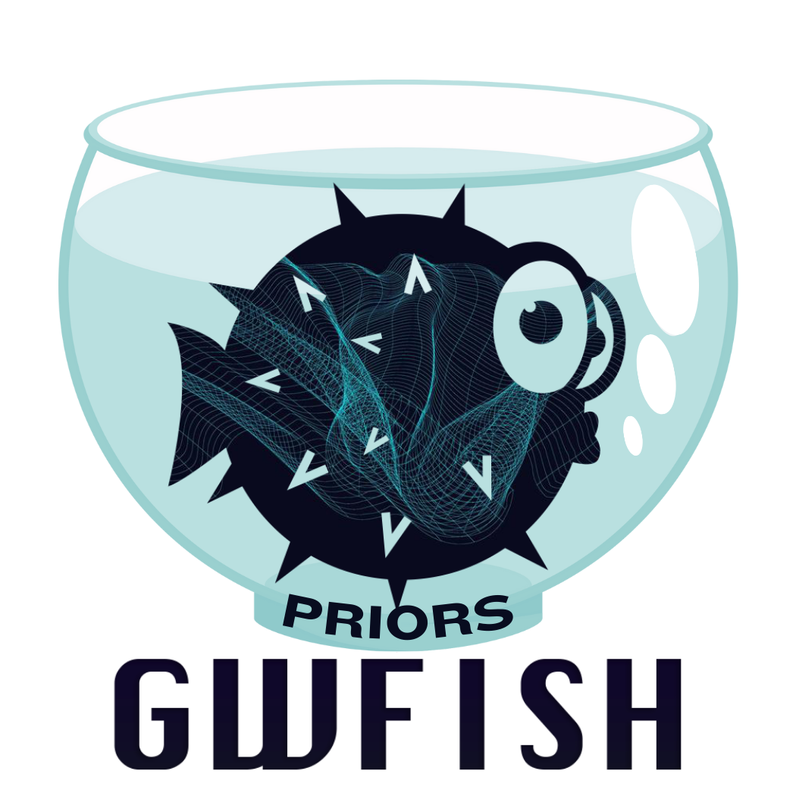

# GWFish-meets-Priors
<p align="center">
  
</p>

Post processing of Fisher matrix results from GWFish with physically informed priors.

Please cite [GWFish+Priors](https://arxiv.org/abs/2404.16103) publication if you make use of the code:
```
@article{Dupletsa:2024gfl,
    author = "Dupletsa, Ulyana and Harms, Jan and Ng, Ken K. Y. and Tissino, Jacopo and Santoliquido, Filippo and Cozzumbo, Andrea",
    title = "{Validating Prior-informed Fisher-matrix Analyses against GWTC Data}",
    eprint = "2404.16103",
    archivePrefix = "arXiv",
    primaryClass = "gr-qc",
    month = "4",
    year = "2024"
}
```
and the related [GWFish](https://doi.org/10.1016/j.ascom.2022.100671) paper:
```
@article{Dupletsa:2022scg,
    author = "Dupletsa, Ulyana and Harms, Jan and Banerjee, Biswajit and Branchesi, Marica and Goncharov, Boris and Maselli, Andrea and Oliveira, Ana Carolina Silva and Ronchini, Samuele and Tissino, Jacopo",
    title = "{gwfish: A simulation software to evaluate parameter-estimation capabilities of gravitational-wave detector networks}",
    eprint = "2205.02499",
    archivePrefix = "arXiv",
    primaryClass = "gr-qc",
    doi = "10.1016/j.ascom.2022.100671",
    journal = "Astron. Comput.",
    volume = "42",
    pages = "100671",
    year = "2023"
}
```
